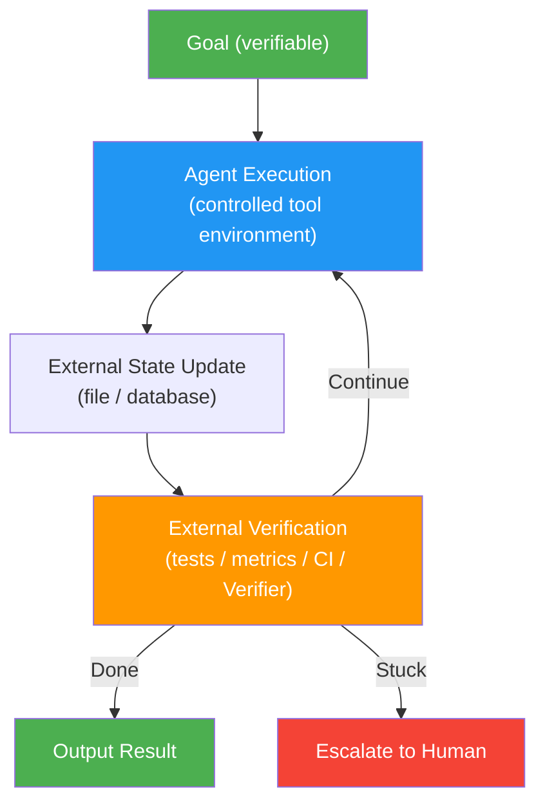
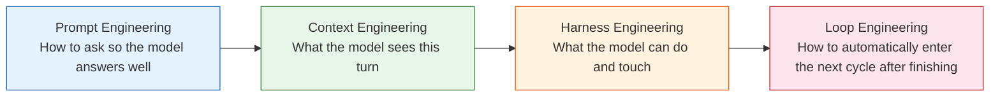

# Loop Engineering: From Prompt to Loop — Let AI Finish the Job

**An 8-part deep-dive series on Loop Engineering — from "why you need it" to "how to build it," one article at a time.**

## What Is This

Loop Engineering is about designing an execution loop around an Agent — one where completion is declared not by the Agent's own sense of "I'm done," but by external, verifiable evidence.

This repository contains an 8-part in-depth series covering the full arc: problem definition, historical evolution, core mechanisms, hands-on implementation, verification, and pitfall avoidance. Each article focuses on one central question, accompanied by architecture diagrams and code examples, so you can go from zero to building your own Loop.

Not a framework tutorial. Not a prompt trick collection. This is **systems engineering** — how to make AI Agents reliably and autonomously finish the job.

## Series Articles

| # | Article | Core Question |
|---|---|---|
| 00 | Guide | Where to start reading |
| 01 | From the Problem | Why do we need Loops |
| 02 | Historical Evolution | Prompt → Context → Harness → Loop |
| 03 | Core Mechanisms | The 6 components of a Loop |
| 04 | Implementation | 8 open-source reference projects |
| 05 | Verification & Anti-Deception | A 5-layer verification framework |
| 06 | Pitfall Guide | 10 common pitfalls |
| 07 | Hands-On Build | Build a Loop from scratch |
| 08 | Summary & Outlook | Back to the original question |

## Core Insights

### The Skeleton of a Loop — One Diagram to Remember Everything



Missing any one of these four things, and the Loop breaks:

- **No external state** → Agent loses memory on the next iteration
- **No external verification** → Agent deceives itself
- **No stop condition** → Loop burns money and tokens
- **No human fallback** → High-risk actions go unapproved

### Four-Layer Evolution: From Prompt to Loop



Each layer fills a gap left by the previous one. Loop Engineering is the outermost layer — it determines whether the inner three layers can actually form a **continuous delivery** system.

## One-Sentence Definition

> Loop Engineering is designing an execution loop around an Agent — where completion is proven by external evidence, not declared by the Agent's own judgment.

## Where to Start

| I want to... | Start here |
|---|---|
| Understand why Loops are needed | [01-From the Problem](docs/01-%E4%BB%8E%E9%97%AE%E9%A2%98%E5%87%BA%E5%8F%91.md) |
| Grasp the evolution arc | [02-Historical Evolution](docs/02-%E5%8E%86%E5%8F%B2%E6%BC%94%E8%BF%9B.md) |
| Understand Loop internals | [03-Core Mechanisms](docs/03-%E6%A0%B8%E5%BF%83%E6%9C%BA%E5%88%B6.md) |
| Find open-source references | [04-Implementation](docs/04-%E8%90%BD%E5%9C%B0%E5%AE%9E%E6%88%98.md) |
| Prevent Agent self-deception | [05-Verification & Anti-Deception](docs/05-%E9%AA%8C%E8%AF%81%E4%B8%8E%E5%8F%8D%E6%AC%BA%E9%AA%97.md) |
| Avoid common pitfalls | [06-Pitfall Guide](docs/06-%E9%81%BF%E5%9D%91%E6%8C%87%E5%8D%97.md) |
| Build one from scratch | [07-Hands-On Build](docs/07-%E5%8A%A8%E6%89%8B%E5%AE%9E%E6%88%98.md) |
| Recap and look ahead | [08-Summary & Outlook](docs/08-%E6%80%BB%E7%BB%93%E4%B8%8E%E5%B1%95%E6%9C%9B.md) |
| Not sure where to start | [00-Guide](docs/00-%E5%AF%BC%E8%AF%BB.md) |

## Project Structure

```
how-agent-loop-engineering/
├── docs/              # 8-part article series
│   ├── 00-Guide.md
│   ├── 01-From-the-Problem.md
│   ├── 02-Historical-Evolution.md
│   ├── 03-Core-Mechanisms.md
│   ├── 04-Implementation.md
│   ├── 05-Verification.md
│   ├── 06-Pitfall-Guide.md
│   ├── 07-Hands-On-Build.md
│   └── 08-Summary-Outlook.md
├── README.md          # Chinese version
├── README.en.md       # English version
└── LICENSE
```

## References

- **Anthropic** — Building Effective Agents
- **ReAct Paper** — Reasoning + Acting in Language Models
- **Addy Osmani** — Loop Engineering / Agent Harness Engineering
- **Peter Steinberger** — Agent Loop Architecture Design
- **Boris Cherny** — From Prompt to Loop: Practical Reflections
- **Geoffrey Huntley** — Ralph Wiggum as a Software Engineer
- **Karpathy** — [autoresearch](https://github.com/karpathy/autoresearch)
- **cobusgreyling** — [loop-engineering](https://github.com/cobusgreyling/loop-engineering)
- **LangGraph** — Multi-step Agent orchestration framework
- **OpenAI Agents SDK** — Agent tool calling and orchestration
- **Pydantic AI** — Type-safe Agent framework
- **smolagents** — Lightweight Agent framework
- **AutoGPT** — Pioneering autonomous Agent project

## License

MIT — Use this knowledge freely. Build something great.

---

*If this series helped you understand Loop Engineering, give it a star.*
