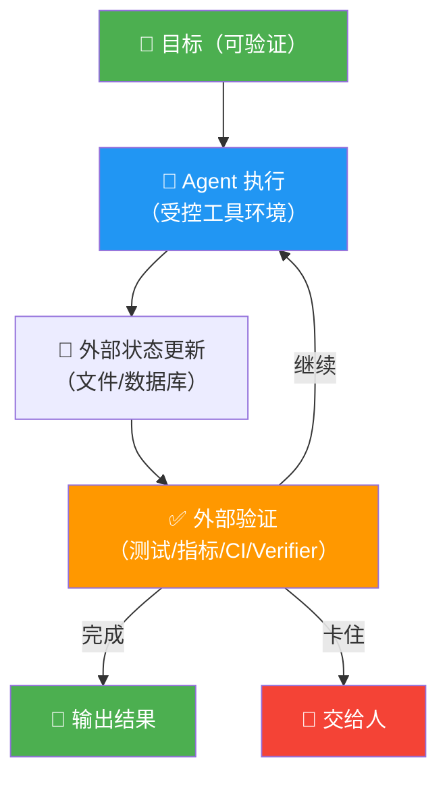
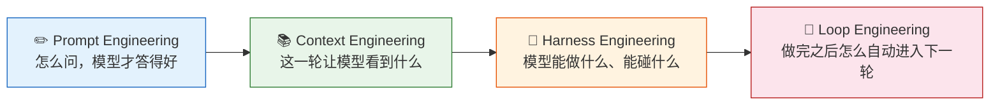

# 🔄 Loop Engineering：从 Prompt 到 Loop，让 AI 自己把事做完

**深入理解 Loop Engineering 的 8 篇系列文章——从"为什么需要"到"怎么落地"，一篇一篇吃透。**

## 这是什么

Loop Engineering 是设计一套围绕 Agent 的执行闭环——让它不靠自我感觉宣布完成，而是靠外部证据证明完成。

这个仓库包含一个 8 篇的深度系列文章，覆盖从问题定义、历史演进、核心机制、落地实战到验证与避坑的完整链路。每篇文章聚焦一个核心问题，配有架构图和代码示例，帮助你从零理解并动手搭建自己的 Loop。

不是框架教程，不是 Prompt 技巧，而是**系统工程**——怎么让 AI Agent 可靠地、自主地把事情做完。

## 系列文章

| 编号 | 文章 | 核心问题 |
|---|---|---|
| 00 | 导读 | 从哪里开始读 |
| 01 | 从问题出发 | 为什么需要 Loop |
| 02 | 历史演进 | Prompt → Context → Harness → Loop |
| 03 | 核心机制 | Loop 的 6 个部件 |
| 04 | 落地实战 | 8 个开源项目参考 |
| 05 | 验证与反欺骗 | 5 层验证框架 |
| 06 | 避坑指南 | 10 个常见坑 |
| 07 | 动手实战 | 从零搭一个 Loop |
| 08 | 总结与展望 | 回到最初的问题 |

## 核心洞察

### Loop 的骨架——一张图记住所有核心



四个东西缺一个，Loop 就会出问题：

- **没有外部状态** → Agent 下一轮失忆
- **没有外部验证** → Agent 自己骗自己
- **没有停止条件** → Loop 烧钱烧 token
- **没有人工兜底** → 高风险动作没人审批

### 四层演进：从 Prompt 到 Loop



每一层都在补上一层的缺口。Loop Engineering 是最外面那层——它决定了前面三层能不能真正形成一个**持续交付**的系统。

## 一句话定义

> Loop Engineering 是设计一套围绕 Agent 的执行闭环——让它不靠自我感觉宣布完成，而是靠外部证据证明完成。

## 从哪里开始读

| 我想… | 从这里开始 |
|---|---|
| 了解为什么需要 Loop | [01-从问题出发](docs/01-从问题出发.md) |
| 理解演进脉络 | [02-历史演进](docs/02-历史演进.md) |
| 搞懂 Loop 的内部结构 | [03-核心机制](docs/03-核心机制.md) |
| 找开源项目参考 | [04-落地实战](docs/04-落地实战.md) |
| 防止 Agent 骗自己 | [05-验证与反欺骗](docs/05-验证与反欺骗.md) |
| 避开常见坑 | [06-避坑指南](docs/06-避坑指南.md) |
| 从零动手搭 | [07-动手实战](docs/07-动手实战.md) |
| 总结回顾 | [08-总结与展望](docs/08-总结与展望.md) |
| 不知道从哪开始 | [00-导读](docs/00-导读.md) |

## 项目结构

```
how-agent-loop-engineering/
├── docs/              # 8 篇系列文章
│   ├── 00-导读.md
│   ├── 01-从问题出发.md
│   ├── 02-历史演进.md
│   ├── 03-核心机制.md
│   ├── 04-落地实战.md
│   ├── 05-验证与反欺骗.md
│   ├── 06-避坑指南.md
│   ├── 07-动手实战.md
│   └── 08-总结与展望.md
├── README.md
├── README.en.md       # English version
└── LICENSE
```

## 参考资料

- **Anthropic** — Building Effective Agents
- **ReAct Paper** — Reasoning + Acting in Language Models
- **Addy Osmani** — Loop Engineering / Agent Harness Engineering
- **Peter Steinberger** — Agent Loop 架构设计
- **Boris Cherny** — 从 Prompt 到 Loop 的实践思考
- **Geoffrey Huntley** — Ralph Wiggum as a Software Engineer
- **Karpathy** — [autoresearch](https://github.com/karpathy/autoresearch)
- **cobusgreyling** — [loop-engineering](https://github.com/cobusgreyling/loop-engineering)
- **LangGraph** — 多步 Agent 编排框架
- **OpenAI Agents SDK** — Agent 工具调用与编排
- **Pydantic AI** — 类型安全的 Agent 框架
- **smolagents** — 轻量级 Agent 框架
- **AutoGPT** — 自主 Agent 先驱项目

## License

MIT — 自由使用这些知识，去构建了不起的东西。

---

*如果这个系列帮你理解了 Loop Engineering，请给个 ⭐*
