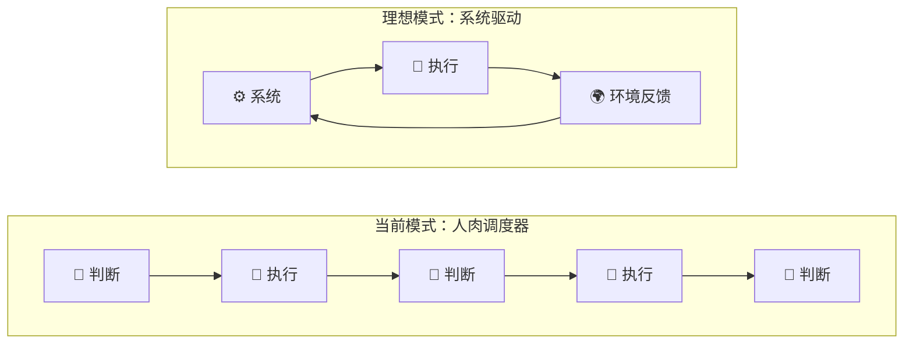
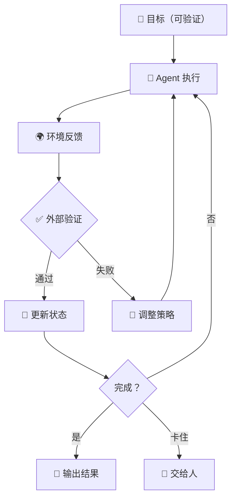

# Loop Engineering 专题（一）：从问题出发——为什么我们需要让 AI 自己"循环干活"

我最近半年一直在用 AI coding agent。

Claude Code、Cursor、Windsurf，能试的都试了。一开始很兴奋，感觉生产力翻倍。但用着用着，我发现一个很不舒服的事情。

我变成了那个"人肉调度器"。

---

## 一个典型的场景

假设有个 bug：用户登录后偶尔会看到别人的头像。

我知道这个问题挺麻烦，涉及缓存、session、和前端渲染。我不太想自己一行行翻代码。于是我打开 Claude Code。

对话大概是这样的：

```text
我：这个 bug 是用户登录后偶尔看到别人的头像，帮我查一下
AI：我看了代码，怀疑是 session 缓存的问题，建议检查 lib/session.ts
我：好的，去看
AI：找到了，redis cache 的 key 里少了 tenantId，确实会串
我：那修吧
AI：改好了，你看一下 diff
我：看起来可以，跑下测试
AI：测试过了，不过有个相关的 lint warning
我：顺便修了
AI：修好了
我：再跑一遍完整测试
AI：全过了
我：行，提交吧
```

你数数，我打了多少次字？

7 次。

AI 本身很聪明，每一步都做对了。但每做完一步，它就停下来等我。等我说"好的"、"去看"、"那修吧"、"跑下测试"、"顺便修了"、"再跑一遍"。

**它能干活，但它不会自己往前走。**

```mermaid
flowchart LR
    A["👤 人说：查 bug"] --> B["🤖 AI 执行"]
    B --> C["⏳ AI 等待"]
    C --> D["👤 人说：继续"]
    D --> E["🤖 AI 执行"]
    E --> F["⏳ AI 等待"]
    F --> G["👤 人说：跑测试"]
    G --> H["🤖 AI 执行"]
    H --> I["⏳ AI 等待"]
    
    style A fill:#ff9800,color:#fff
    style D fill:#ff9800,color:#fff
    style G fill:#ff9800,color:#fff
    style C fill:#e0e0e0,color:#333
    style F fill:#e0e0e0,color:#333
    style I fill:#e0e0e0,color:#333
```


**图 1：人工调度模式——每一步之间都是人在推动**

---

## 这个问题比你想的严重

你可能觉得：不就多打几个字吗？

但你想一下这个 bug 的修复流程，拆开看其实是这些步骤：

1. 理解 bug 描述
2. 找到相关代码
3. 定位根因
4. 修复
5. 跑受影响的测试
6. 处理 lint 问题
7. 跑完整测试
8. 提交

8 个步骤，每一步之间的"你告诉我继续"就是 7 次人工干预。

如果这个 bug 更复杂呢？如果需要改 3 个文件，需要查文档，需要验证不同浏览器的表现呢？步骤可能变成 15 步、20 步。

而每多一步，你都要做一次判断：上一步的结果对不对？下一步该干嘛？要不要继续？

**你不是在用工具，你是在带实习生。**

而且是那种很靠谱但每件事都要请示的实习生。

---

## 问题出在哪？

我后来想明白了一件事。

传统聊天机器人的模式是：

```text
用户问 → AI 答 → 结束
```

这是一个一问一答的循环。问题简单的时候，这个模式完全够用。

但真正的工作不是一问一答。

**真正的工作是"完成一件事"。**

完成一件事意味着：你需要根据中间结果，决定下一步做什么。如果测试挂了，要修测试；如果发现还有相关问题，要顺便处理；如果改错了，要回退重来。

这是一条有分支、有回退、有判断的路径。

而我们现在的方式，是把所有判断都扔给了人。

```text
人判断 → AI 执行 → 人判断 → AI 执行 → 人判断 → AI 执行 → ...
```


**图 2：从人肉调度到系统驱动**

AI 的执行变快了，但人的判断频率没变。

甚至更糟：因为 AI 做得越来越快，你判断的节奏反而被压缩了。你感觉自己在被推着走，但每一步又得你来拍板。

**快的是 AI，累的是你。**

---

## 瓶颈到底在哪？

以前用 Copilot 的时候，瓶颈是"AI 能不能写对"。

现在用 Claude Code、Cursor Agent 模式的时候，瓶颈变了。

AI 写对的概率已经很高了。

真正的瓶颈变成了：**谁来告诉 AI 下一步做什么？**

你可能会说：这不就是 orchestration 吗？

对，但不是那种高大上的 multi-agent orchestration。

是很朴素的：

- AI 完成了上一步
- 我得看结果
- 我得想下一步
- 我得告诉 AI

这个"看结果 → 想下一步 → 告诉 AI"的循环，才是真正的成本。

不是 token 的成本。不是 API 的成本。

**是你注意力的成本。**

你的注意力被打碎成了一小段一小段。每段之间，你得切换上下文、理解当前状态、做出判断。

这是真正累人的地方。

---

## 那如果……不是人来驱动呢？

我后来一直在想一个问题：

如果我把"下一步该做什么"这件事也交给系统呢？

不是让 AI 自己随便跑。那是 AutoGPT 早期干的事，结果大家都看到了——跑着跑着就跑偏了，或者陷入死循环。

而是一种更结构化的方式：

```text
系统：现在状态是 X，目标是 Y，你去做 Z。
AI：做完了，结果是这样。
系统：我看一下（跑测试 / 检查 / 对比），嗯，确实完成了。下一个任务是 W。
AI：做完了……
系统：嗯，还没完，测试挂了，错误信息是这个，你修一下。
```

注意这里的变化。

驱动者从"人"变成了"系统"。

人不再需要盯着每一步。人只需要：

1. 把目标定义清楚
2. 把验证规则写好
3. 让系统去跑

出了问题，系统会来问你。
没问题，系统会自己继续。
到了关键决策点，系统会暂停等你审批。

**你的角色从"实习生的监工"变成了"项目经理"。**

你只管定义目标和检查结果，中间的执行过程系统自己走。

---

## 这就是 Loop Engineering 的起点

你可能已经隐约感觉到了。我们说的不是"怎么写更好的 prompt"。

我们说的是一个完全不同的事情：

> **怎么设计一个系统，让 AI agent 能自己循环干活，直到把事情做完？**

关键词是"系统"和"循环"。

系统意味着：不是靠人嘴说，而是靠代码、文件、状态机、测试来控制。

循环意味着：不是一次性的 prompt，而是"执行 → 检查 → 再执行"的闭环。

这两件事加在一起，就是 Loop Engineering。

不是什么新概念。工程领域一直在干类似的事：CI/CD pipeline、自动化测试、监控告警。都是"跑 → 检查 → 自动响应"的循环。

只不过这次，循环中间的执行者从 shell 脚本变成了 AI agent。

而 agent 比脚本聪明太多了，也比脚本危险太多了。

所以它需要的控制系统也复杂得多。

---

## 后面会聊什么

接下来的几篇文章，我们会把这个系统拆开聊：

最小的 Loop 长什么样？（不是你想的 while true）
状态怎么管理？（agent 是个健忘症患者，怎么办）
谁来验证结果？（agent 自己说"做完了"你信不信）
多个 agent 怎么协作？（一个干不完，几个接力呢）
哪些事能放手，哪些必须人拍板？（安全边界在哪里）
怎么落地？（别光说理论，给模板）

每一篇都会落到具体的代码、设计、和真实场景。

不是概念堆砌。是你看完就能动手的东西。

---

下一篇，我们先聊最小的 Loop 形态。

你会看到，一个不到 5 行的 bash 脚本，就已经包含了 Loop Engineering 的核心思想。

挺有意思的。



**图 3：这就是 Loop Engineering 的核心——系统驱动的执行闭环**
