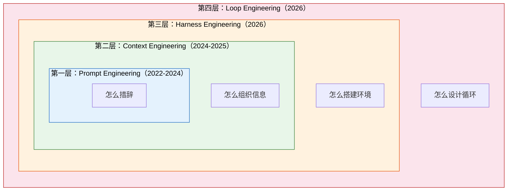
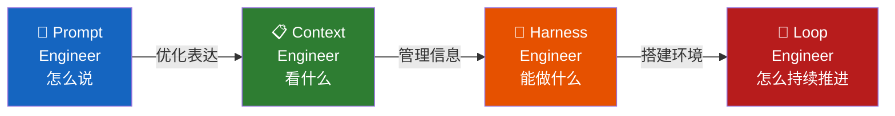

# Loop Engineering 专题（二）：历史演进——从一句提示词到一个循环系统，AI 应用的四层进化

> 你以为 Prompt 写得好就能搞定一切？不好意思，那只是第一层。

我最近在整理 AI 应用开发的演进脉络，发现一件有意思的事——

过去三年，我们对"怎么跟 AI 协作"这件事的理解，一直在变。

从最开始琢磨怎么写好一句提示词，到后来研究怎么给模型喂上下文，再到搭建整个 Agent 环境，最后到设计一整套循环控制系统。

**每一步都不是推翻前一步，而是在外面包了一层新东西。**

这篇文章，就是把这四层进化掰开了讲清楚。读完你会拿到一个清晰的分层框架，知道每种工程范式解决什么问题、卡在哪里、什么时候该用哪一层。


**图 1：四层递进——每一层包裹前一层，而不是替代**

---

## 第一层：Prompt Engineering（2022-2024）

最开始，大家琢磨的就是一件事：**怎么把话说清楚**。

同一个模型，你换个问法，效果可能天差地别。

```markdown
❌ "帮我写个函数"
✅ "用 Python 写一个函数，输入一个字符串列表，返回去重后按字母排序的结果"
```

```markdown
❌ "总结一下这篇文章"
✅ "用 3 个要点总结这篇文章的核心观点，每个要点不超过 20 个字"
```

差别在哪？**后者给了明确的约束和结构。**

Prompt Engineering 本质上是**人脑在做质量控制**——你得提前想清楚要什么，然后精确地表达出来。

问题在哪？**它是一锤子买卖。**

模型给你一个结果，你看完不满意？再写一条。但每轮都是独立的，没有记忆，没有修正，没有自动重试。本质上还是单轮对话。

做做翻译、写写文案、提取个结构化数据，够用。但一旦任务复杂一点——比如"帮我重构这段代码然后跑测试看有没有挂"——它就接不住了。

---

## 第二层：Context Engineering（2024-2025）

后来大家发现，模型的表现不只取决于你怎么问，还取决于**你给它看了什么**。

这就是 Context Engineering——上下文工程。

LangChain 团队总结了上下文管理的四个核心操作：

| 操作 | 干什么 | 例子 |
|------|--------|------|
| **Write** | 往上下文里写入新信息 | 工具调用结果、搜索结果 |
| **Select** | 从候选里挑出最相关的内容 | RAG 检索、历史消息筛选 |
| **Compress** | 把长内容压缩成摘要 | `compact` 模式自动摘要 |
| **Isolate** | 把不同任务放到独立上下文里 | 子 Agent 隔离、多文件编辑 |

你可能已经在用了，只是没意识到它叫这个名字：

- `CLAUDE.md`——你往里写的每一条项目规范，就是在 Write
- 对话太长时用 `compact` 压缩历史——就是在 Compress
- 子 Agent 处理子任务，不污染主对话——就是在 Isolate

Context Engineering 的核心洞察是：**模型是瞎的，你给它什么，它就看到什么。**

所以你的工作从"怎么措辞"变成了"怎么组织信息"。

但 Context Engineering 依然是在单轮对话的框架里优化。信息组织得再好，模型也只是被动地接收、处理、输出。**它不会主动去干下一步。**

---

## 第三层：Harness Engineering（2026）

2026 年初，Addy Osmani 提出了一个概念：**Agent Harness Engineering**。

他的核心观点是：光设计 Agent 本身不够，你得设计**Agent 运行的整个环境**。

Harness 这个词来自赛车——安全笼架。它不是引擎，但没有它你不敢踩油门。

Harness Engineering 包括什么？

- **工具层**：Agent 能调用哪些 API、读写哪些文件、执行哪些命令
- **沙箱**：Agent 在安全的环境里操作，搞砸了不会炸掉生产环境
- **权限控制**：哪些操作需要人工确认，哪些可以自动执行
- **Hook 系统**：在关键节点插入检查——提交前跑 lint，合并前跑测试
- **Guardrails**：防止 Agent 跑偏的安全护栏

这时候你开始意识到：**Agent 不是一个单独的模型，而是一个运行在特定环境里的程序。**

你设计的不是"AI 怎么回答"，而是"AI 能干什么、不能干什么、出事了怎么办"。

这是一个重要的认知跃迁。但 Harness Engineering 仍然聚焦在"环境搭建"上——它定义了 Agent 的能力边界，但**没有定义 Agent 怎么一步步往前走**。

---

## 第四层：Loop Engineering（2026）

终于到了这篇文章的主角。

Geoffrey Huntley 提出了著名的 Ralph Wiggum 技巧——让 Agent 自己循环执行，直到任务完成。Peter Steinberger 在推特上直言：**"你设计的是 loop，不是 prompt。"** Boris Cherny 也说过类似的话：**"我写的不再是提示词，我写的是循环。"**

Anthropic 在 2024 年底发布的《Building effective agents》里其实已经埋下了伏笔——他们对 Agent 的定义是：

> "LLMs using tools based on environmental feedback **in a loop**."

关键词：**in a loop**。

Loop Engineering 设计的是**驱动 Agent 的整个控制循环**：

```markdown
while not done:
    1. 观察当前状态
    2. 决定下一步动作
    3. 执行动作
    4. 获取反馈
    5. 判断是否完成 → 完成则退出，否则继续
```

这不是一个新的发明。学术界的 ReAct 论文（Yao et al., 2022）早就提出了"思考-行动-观察"的循环范式。但 ReAct 当年更多是在做研究，Loop Engineering 是把这套东西**工程化、产品化、可运维**。

区别在于：

- ReAct 是论文里的伪代码
- Loop Engineering 是生产环境里的状态管理、错误恢复、成本控制、人机协同

**Loop Engineering 的核心洞察是：Agent 只是执行引擎，真正的杠杆在围绕它的那个循环。**

---

## 四层关系：包裹，而非替代

这里有一个很常见的误解：后来的范式会取代前面的。

不会。

```
┌─────────────────────────────────────┐
│  Loop Engineering（控制循环）         │
│  ┌─────────────────────────────────┐│
│  │  Harness Engineering（运行环境） ││
│  │  ┌─────────────────────────────┐││
│  │  │  Context Engineering（上下文）│││
│  │  │  ┌─────────────────────────┐│││
│  │  │  │  Prompt Engineering     ││││
+│  │  │  │  （提示词）             ││││
│  │  │  └─────────────────────────┘│││
│  │  └─────────────────────────────┘││
│  └─────────────────────────────────┘│
└─────────────────────────────────────┘
```

每一层都包裹着前一层，而不是替代它：

- Loop 再精妙，里面的 Agent 还是要靠好的 Context 才能干活
- Context 组织得再好，Prompt 本身写得烂也白搭
- 但反过来，Prompt 写得完美，也解决不了"怎么自动重试"的问题

**每层解决不同层级的问题，它们是协作关系，不是竞争关系。**

---

## 一张表看清四层

| 层 | 时期 | 核心问题 | 解决方式 | 局限 |
|----|------|----------|----------|------|
| **Prompt Engineering** | 2022-2024 | 怎么把话说清楚？ | 优化单条指令的措辞和结构 | 单轮、无记忆、无自动修正 |
| **Context Engineering** | 2024-2025 | 模型该看到什么？ | Write/Select/Compress/Isolate 管理上下文 | 仍是被动接收，不会主动推进 |
| **Harness Engineering** | 2026 | Agent 能做什么、安全边界在哪？ | 工具、沙箱、权限、Hook、Guardrails | 定义了能力边界，没定义执行节奏 |
| **Loop Engineering** | 2026 | 怎么驱动 Agent 循环执行直到完成？ | 设计完整的观察-行动-验证循环 | 系统复杂度更高，需要运维思维 |

---

## 核心洞察：杠杆转移了

回到开头的问题：写好一句提示词就够了吗？

2023 年，够了。
2025 年，不太够了。
2026 年，远远不够了。

**真正的杠杆，已经从"你措辞的精度"转移到了"你设计循环的结构"。**

一个精心设计的 loop，哪怕里面的 prompt 只是"还行"，也能通过多轮验证、自动修正、状态追踪，最终交付一个不错的结果。

反过来，一个天才级的 prompt，放进一个没有循环的系统里，也只能做一次性的事情。

这就是 Loop Engineering 存在的意义。

---

> 下一篇我们会拆开 Loop 看看它里面的部件——Trigger、Goal、Action、State、Verification、Stop，一个都不能少。



**图 2：四层演进路径——杠杆点从措辞移到了循环设计**

