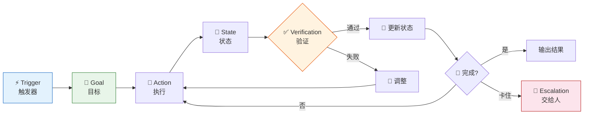
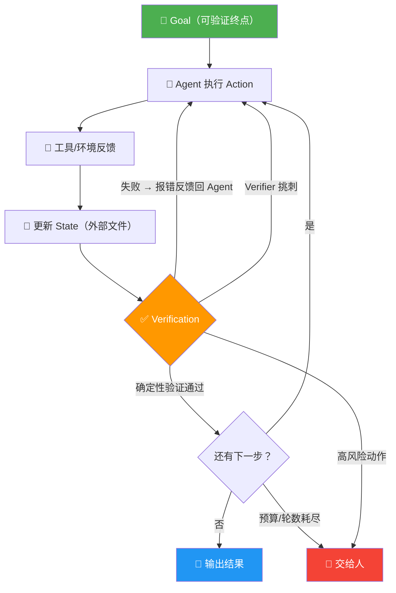

# Loop Engineering 专题（三）：核心机制——一个成熟 Loop 长什么样，6 个部件缺一不可

上一篇讲了演进历史，这篇我们拆开 Loop 看看它里面到底有什么。

说实话，我第一次尝试用 Loop 驱动 Agent 的时候，写了个 `while not done` 就觉得自己已经搞定了。

结果？Agent 在第 3 轮开始重复自己，第 5 轮跑偏了，第 8 轮直接把测试文件删了。💀

后来我才明白：**一个能跑的 Loop 和一个能交付的 Loop，中间差了整整一套工程设计。**

这篇文章会把 Loop 的 6 个核心部件逐个拆解。每个部件都会讲清楚三件事：它解决什么问题、没有它会怎样、实际长什么样。

---

## 一个完整 Loop 的 6 个部件

先看全局：

```
Trigger → Goal → [ Action → State → Verification ] ←→ Stop/Escalation
                    ↑         │
                    └─────────┘  (循环)
```


**图 1：一个成熟 Loop 的完整结构**

中间的 Action → State → Verification 是循环体，Trigger 是入口，Goal 是终点，Stop/Escalation 是安全阀。

下面逐个拆。

---

## 1. Trigger：谁来按下启动键

**解决什么问题：** Loop 不会自己跑起来，它需要一个明确的启动信号。

**没有它会怎样：** Loop 的启动条件是模糊的——"差不多了就跑"？什么叫"差不多了"？

常见的 Trigger 类型：

| Trigger | 例子 |
|---------|------|
| 定时调度 | 每天凌晨 2 点跑一次数据清洗 |
| 事件驱动 | CI 挂了自动触发修复流程 |
| 人工指令 | "开始重构这个模块" |
| 系统信号 | 监控告警、文件变更、PR 提交 |

关键点：**Trigger 必须是明确的、可判断的、无歧义的。**

```python
# ✅ 好的 Trigger：CI 管道失败
if pipeline.status == "failed":
    start_loop()

# ❌ 坏的 Trigger：语义模糊
if "可能需要优化":  # 什么叫可能？
    start_loop()
```

你设计 Loop 的第一件事，不是想 Agent 要干什么，而是想**什么条件满足了才让它开始干**。

---

## 2. Goal：终点长什么样

**解决什么问题：** Agent 需要知道什么时候该停下来。"做完"不是一个主观判断，它必须是可验证的。

**没有它会怎样：** Agent 会无限循环，或者在"差不多了"的时候停不下来，又或者在根本没做完的时候就提前退出。

好的 Goal 长这样：

```markdown
- 所有测试通过 ✅
- 代码覆盖率不低于 85% ✅
- 无 lint 警告 ✅
- PR 已创建且状态为 "ready for review" ✅
```

坏的 Goal 长这样：

```markdown
- 代码质量不错了 ❌ （什么叫不错？）
- 改完了吧 ❌ （改完和修好不是一个意思）
```

**Goal 的核心要求：二值性。要么达成，要么没达成。没有中间状态。**

如果一个 Goal 你没法写成 `assert`，那它就不配当 Goal。

---

## 3. Action：Agent 能干什么

**解决什么问题：** Agent 需要一组明确的操作权限——能读什么文件、能写什么代码、能跑什么命令、能调什么 API。

**没有它会怎样：** 要么 Agent 啥也不敢干（权限太少），要么 Agent 啥都敢干（权限太多，然后把生产环境搞炸）。

一个成熟的 Loop 里，Action 通常包括：

| 类别 | 具体能力 |
|------|----------|
| 文件操作 | 读、写、移动、删除代码文件 |
| 终端执行 | 运行测试、构建、lint |
| 版本控制 | git commit、push、创建分支 |
| 外部交互 | 调 MCP 工具、查 API、读数据库 |
| 协作通信 | 创建 PR、写评论、通知相关人员 |

关键原则：**Action 的粒度要适中。**

太粗——"修复这个 bug"——Agent 不知道从哪下手。
太细——"把第 42 行的 `x` 改成 `y`"——那还要 Agent 干什么？

好的 Action 定义是：**Agent 能理解的、有明确语义的操作单元。**

---

## 4. State：进度怎么记

**解决什么问题：** Loop 会跑很多轮。第 3 轮做的事，第 7 轮得记得。否则 Agent 每轮都在重新读代码、重新分析、重复劳动。

**没有它会怎样：** Agent 会在第 5 轮把第 2 轮的改动推翻重来，因为它不记得自己已经改过了。

State 的载体有很多：

```markdown
- STATE.md     # 结构化的状态文件，记录当前进度
- TODO.md      # 待办事项列表，完成一项勾一项
- 对话历史     # 上下文窗口里的消息记录
- Git 日志     # commit 历史本身就是一种状态
- Issue Board   # 外部任务管理工具的状态
- 数据库        # 结构化存储，适合复杂状态
```

```markdown
# STATE.md 示例
## 当前阶段：修复测试失败
## 已完成
- [x] 定位到 test_auth.py 第 34 行的 mock 缺失
- [x] 修复了 mock 配置
## 进行中
- [ ] 跑完整测试套件确认无其他副作用
## 待处理
- [ ] 更新相关文档
```

State 的核心要求：**Agent 在任何一轮开始时，都能通过读取 State 恢复完整的工作记忆。**

如果 Agent 必须依赖"上一轮对话还记得"才能继续工作，那你的 State 设计就有问题。因为上下文窗口是有限的，历史对话迟早会被压缩或丢弃。

---

## 5. Verification：谁来判断完没完

**解决什么问题：** Goal 定义了"什么叫完成"，Verification 负责**实际去验证**。

**没有它会怎样：** Agent 自己说"我改好了"，然后就退了。你一跑测试，挂了三个。

这是一个非常容易被忽略的部件。很多人让 Agent 自己判断是否完成——这就好比让考生自己给自己打分。

常见的 Verification 手段：

| 手段 | 适用场景 | 可靠性 |
|------|----------|--------|
| 单元测试 | 代码变更后验证功能正确性 | ⭐⭐⭐⭐⭐ |
| Lint + 类型检查 | 代码质量验证 | ⭐⭐⭐⭐ |
| CI 管道 | 端到端的集成验证 | ⭐⭐⭐⭐⭐ |
| 指标监控 | 性能、覆盖率、错误率 | ⭐⭐⭐⭐ |
| Verifier Agent | 用另一个 Agent 做 review | ⭐⭐⭐ |
| 人工确认 | 需要主观判断的场景 | ⭐⭐ |

关键原则：**Verification 应该尽可能自动化和客观化。**

能让测试跑的就不要让人看，能用 CI 的就不要只靠 lint。

还有一个很实用的技巧：**Verification 和 Action 应该分离。** 验证的人不应该同时是做事的人——就像代码审查不应该让作者自己做一样。

---

## 6. Stop / Escalation：什么时候停

**解决什么问题：** 不是所有 Loop 都能顺利完成。你需要明确的退出条件和升级机制。

**没有它会怎样：** Agent 会陷入死循环，烧光 token 预算，或者在危险边缘反复试探。

Stop 条件示例：

```markdown
- 达到最大轮次（比如 20 轮） → 停止并报告
- Token 消耗超过预算 → 停止并通知
- 连续 3 轮没有进展 → 停止并报告卡在哪里
- 触发了安全边界（试图修改生产数据库） → 立即停止并升级给人
```

Escalation 机制示例：

```markdown
- 遇到不确定的设计决策 → 升级给人，附上选项和建议
- 遇到权限不足的操作 → 暂停，等待人工授权
- 遇到无法自动验证的改动 → 暂停，等待人工 review
```

**Stop 不是失败，Escalation 也不是无能。它们是系统的安全机制。**

一个没有 Stop 的 Loop，就像一辆没有刹车的车——快是快，但你不敢坐。

---

## Agent 只是中间的执行引擎

很多人把"Agent"当成 Loop Engineering 的核心。

不是。

Agent 只是**执行引擎**——它负责在每一轮里理解任务、选择动作、产出结果。但围绕它的那一整套东西——什么时候启动、目标是什么、能做什么、进度怎么记、怎么验证、什么时候停——**这些才是 Loop Engineering 真正设计的对象**。

打个比方：

> Agent 是赛车手。Loop Engineering 设计的是赛道、规则、计时系统、安全措施和终点线。

赛车手再强，没有赛道也没法比赛。

---

## 伪代码：一个完整的 Loop

把 6 个部件放在一起，一个成熟的 Loop 长这样：

```python
def loop(trigger_event):
    # 1. Trigger
    if not should_start(trigger_event):
        return

    goal = load_goal()           # 2. Goal：加载可验证的终点定义
    state = load_state()         # 4. State：恢复工作记忆

    for turn in range(MAX_TURNS):  # 6. Stop：最大轮次兜底
        if budget_exceeded():      # 6. Stop：预算保护
            escalate("budget exceeded")
            return

        # 3. Action：让 Agent 执行一步
        action = agent.decide(state, goal)
        result = execute(action)

        # 更新状态
        state = update_state(state, result)
        save_state(state)

        # 5. Verification：检查是否达标
        if verify(goal, state):
            report_success(state)
            return  # Goal 达成，退出

        if no_progress(state, recent_turns=3):
            escalate("no progress for 3 turns")
            return  # 6. Stop：无进展退出

    escalate("max turns reached")
```

注意看：Agent 的 `decide` 只在中间被调用了一次。其他所有东西——触发、目标、状态、验证、停止——都是 Loop 框架在管。

这就是 Loop Engineering 的本质：**你设计的不是 AI 怎么思考，而是 AI 在什么框架里思考。**


**图 2：Loop 的判断逻辑——每一步都在问"够了吗？该停了吗？"**

---

## 最后说一句

回到我开头的那次翻车经历——Agent 删测试文件那次。

现在你知道问题出在哪了：我当时只有一个 Trigger（"开始修 bug"）和一个模糊的 Goal（"改好"），没有 State、没有 Verification、没有 Stop。

6 个部件缺了 4 个，不翻车才怪。

> 一个成熟的 Loop 不是"让 Agent 跑起来"，而是"让 Agent 在一个可控的、可验证的、可恢复的循环里跑起来"。

---

> 下一篇会聊怎么把这些部件落地到具体的工程实践里——选什么状态管理、怎么做验证、Stop 条件怎么定才合理。实战篇，敬请期待。
