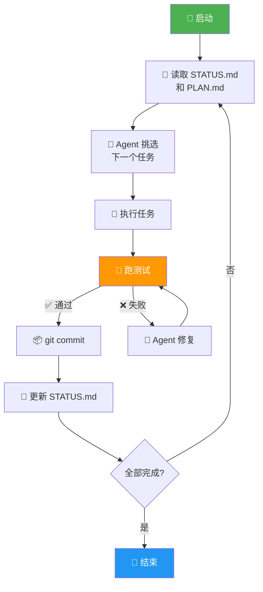
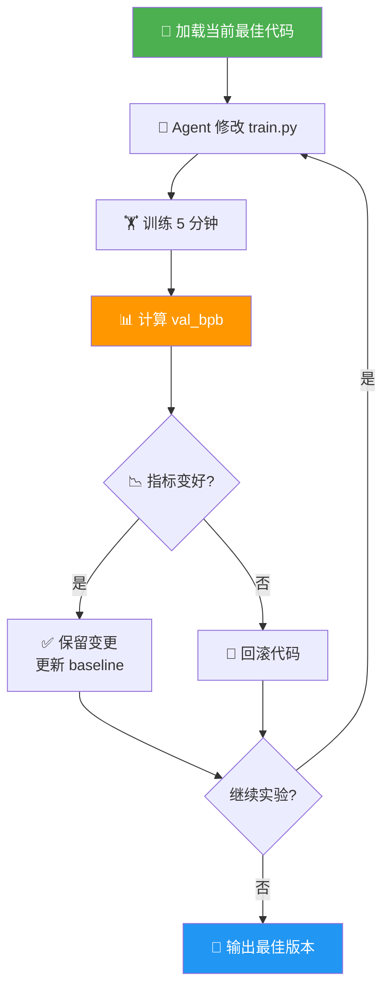
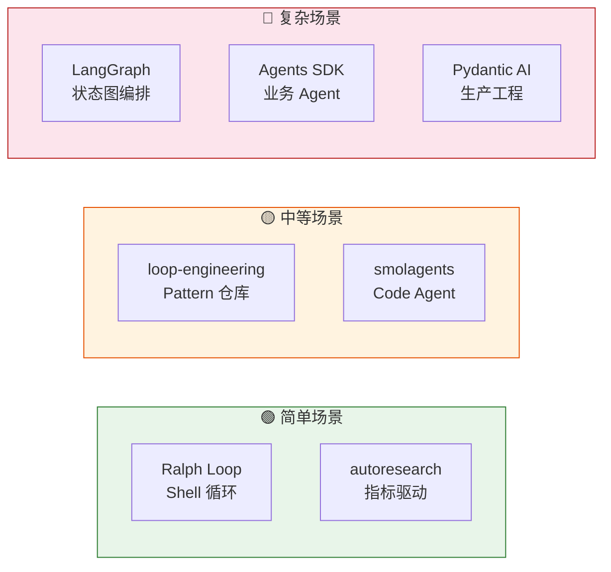

# Loop Engineering 专题（四）：落地实战——8 个开源项目，每种 Loop 都有现成参考

前几篇我们一直在聊 Loop 的"道"——什么时候该用、怎么设计、怎么防骗。

这篇换个口味，直接看"术"。

**8 个开源项目，每种 Loop 思路都有现成的代码可以参考。** 不用从零造轮子，但你得知道轮子长什么样、适合什么场景。

> 说白了：不是让你背项目名，而是帮你建立一个"选型雷达"——下次遇到具体问题，你知道往哪个方向找。

---

## 1. Ralph Loop（Geoffrey Huntley）——最简单的 Shell Loop

这个项目是我见过最朴素的 Loop 实现。核心代码就是一个 Shell 循环：

```bash
#!/bin/bash
# Ralph Loop: 一个任务进，一个结果出
TASK_FILE="current_task.md"
RESULT_DIR="results/"

while true; do
  # 1. 读取任务
  TASK=$(cat "$TASK_FILE")

  # 2. 调用 LLM 完成任务
  RESULT=$(echo "$TASK" | llm-complete)

  # 3. 保存结果（外部记忆）
  echo "$RESULT" >> "$RESULT_DIR$(date +%s).md"

  # 4. 清空当前任务，进入下一轮
  rm "$TASK_FILE"
  sleep 5  # back pressure：等人放入下一个任务
done
```

看着简单？对，**就是因为简单才好用**。

它的精髓在于：
- **一个任务 per loop**：每次循环只做一件事
- **全新上下文**：不保留历史对话，LLM 每次都是白纸一张
- **磁盘当记忆**：结果写文件，不塞 context window
- **back pressure**：任务文件没了就停，不会空转烧钱

**适合场景**：批量处理同质化任务（批量翻译、批量生成报告、批量代码审查）。
**关键收获**：Loop 的本质可以非常简单——一个 while 循环就够了。

---


**图 1：Ralph Loop 流程——每轮读外部状态、做一件事、跑测试、更新状态**


## 2. Karpathy's autoresearch——指标驱动的自律 Loop

Karpathy 的 autoresearch 是"Agent 不能自己宣布胜利"的完美实践。

核心逻辑：
1. 固定 5 分钟训练窗口
2. 跑完看 `val_bpb`（验证集 bits-per-byte）
3. 指标变好 → 保留代码变更
4. 指标变差 → 自动回滚到上一个版本

```python
# 伪代码：指标驱动的 Loop
def autoresearch_loop():
    best_code = load_current()
    while True:
        new_code = llm_mutate(best_code)
        score = train_and_evaluate(new_code)  # val_bpb
        if score < best_score:       # 指标更好
            best_code = new_code
            best_score = score
        else:                         # 指标更差
            rollback(best_code)       # 回滚，Agent 说了不算
```

**这就是"Agent 不能 lie"模式**——你说没用，我只看数字。数字不涨，你的代码就白改了。

**适合场景**：需要持续优化的实验性任务（模型调参、prompt 工程、算法探索）。
**关键收获**：用**客观指标**代替 Agent 的主观判断，是最可靠的 Loop 退出条件。

---


**图 2：autoresearch Loop——指标是唯一裁判，Agent 说了不算**


## 3. cobusgreyling/loop-engineering——Loop 模式仓库

这个仓库是 Loop 的"菜谱集"，按成熟度分了三层：

| 级别 | 模式 | Agent 权限 |
|------|------|-----------|
| L1 | 只读报告 | 只观察，不动手 |
| L2 | 草稿审批 | 可以写，人来批 |
| L3 | 全自动合并 | CI 通过就合并 |

**L1 → L2 → L3 是渐进式的**。你不能一上来就让 Agent 全自动合并——就像你不会让实习生第一天就拥有代码库的 push 权限。

**适合场景**：团队想系统性地引入 Loop，需要一个"从安全到激进"的落地路径。
**关键收获**：Loop 的成熟度要分级，L1/L2/L3 是一个值得参考的分级框架。

---

## 4. LangGraph——有状态的生产级 Loop 运行时

LangGraph 是目前做 Loop 最"重"的框架。它的核心能力是：**状态图 + checkpoint + interrupt + resume**。

```python
from langgraph.graph import StateGraph
from langgraph.checkpoint.memory import MemorySaver

def build_loop():
    graph = StateGraph(AgentState)
    graph.add_node("research", research_node)
    graph.add_node("write", write_node)
    graph.add_node("review", review_node)

    # 关键：interrupt 在 review 节点
    graph.add_node("human_approval", interrupt_node)

    graph.add_edge("research", "write")
    graph.add_edge("write", "human_approval")
    graph.add_conditional_edges("human_approval", route_decision)

    return graph.compile(
        checkpointer=MemorySaver(),
        interrupt_before=["human_approval"]
    )
```

interrupt 模式是 LangGraph 的杀手锏——**Agent 跑到需要人审批的地方自动暂停，等人点头后继续**。就像工厂流水线上的质检站：不合格就停线，合格才放行。

**适合场景**：需要多步决策、中间有人工审批、需要断点恢复的生产级工作流。
**关键收获**：interrupt + resume 是 Loop 的"工业级"实现，值得作为生产环境的首选。

---

## 5. OpenAI Agents SDK——轻量级 Harness + Loop

OpenAI 的 Agents SDK 走的是另一条路：**把 Loop 做轻，把工具做全**。

它的 Loop 不是框架帮你跑的，而是你自己在代码里写 while 循环。但 SDK 提供了关键的基础设施：

```python
from agents import Agent, Runner, handoff

agent = Agent(
    name="Research Agent",
    tools=[web_search, code_interpreter],
    guardrails=[safety_check],  # 安全护栏
)

result = Runner.run_sync(agent, task="分析这个 bug")
# 结果带完整 trace，可审计
```

五个关键词：**tools、guardrails、human-in-the-loop、tracing、sandbox**。
就像给你一套乐高积木——拼成什么样你自己决定，但每块积木都很可靠。

**适合场景**：想快速原型验证 Loop 想法，不想被框架绑死。
**关键收获**：Loop 不一定要框架级实现，轻量 SDK + 你自己写的 while 循环也够用。

---

## 6. Pydantic AI + Pydantic Evals——类型安全的代码即评估

这对组合解决的是两个痛点：**类型安全 + 评估可复现**。

```python
from pydantic_ai import Agent
from pydantic_evals import Case, Dataset, Evaluator

# 类型安全的 Agent
agent = Agent('gpt-4', system_prompt="你是代码审查员")

# 定义评估用例
dataset = Dataset[CodeReviewCase, ReviewResult]()

# 明确的评估器：代码即标准
class CorrectnessEvaluator(Evaluator):
    def evaluate(self, output, case):
        # 用代码判断，不是让 Agent 自评
        return {"passed": output.fixed_the_bug == case.expected}
```

**Dataset → Case → Experiment → Evaluator**，这条链路是纯代码的。
不是让人去点"通过/不通过"，也不是让 Agent 自己说"我搞定了"。代码说了算。

**适合场景**：需要可复现、可审计的 Loop 评估，尤其是涉及质量把控的场景。
**关键收获**：评估必须是**确定性的**，代码比人可靠，更比 Agent 可靠。

---

## 7. smolagents——代码即行动

smolagents 是 Hugging Face 出品的框架，它有个大胆的设计：**Agent 的每一步行动都是 Python 代码，直接在沙箱里执行**。

```python
from smolagents import CodeAgent

agent = CodeAgent(
    model=model,
    tools=[search_tool, calculator],
    add_base_tools=True,
)

# Agent 输出的不是 "我搜索了 xxx"
# 而是一段可执行的 Python 代码
result = agent.run("帮我查一下最新论文，总结前 3 篇")
```

传统 Agent 的 action 是函数调用（JSON 描述），smolagents 直接用 Python 代码当 action。
好处是：**代码本身可以被 lint、被测试、被 review**——比自然语言描述的 action 可靠得多。

**适合场景**：数据处理、科学计算、需要精确操作的 Agent 任务。
**关键收获**："代码即 action"让 Loop 的每一步都可审计、可回滚。

---

## 8. AutoGPT——从自治 Agent 到工作流平台

AutoGPT 的故事本身就是一部 Loop 进化史。

早期版本是"全自治"模式：给个目标，Agent 自己想怎么干，自己决定什么时候停。
结果呢？跑飞、烧钱、陷入死循环。

现在的版本已经进化成**工作流平台**——你定义节点、定义边、定义条件。
Loop 不再是 Agent 的"自治"，而是你设计的"管控"。

这个转变很有意思：**从"Agent 自己决定要不要 Loop"变成了"人决定 Loop 的形状，Agent 只负责干活"**。

**适合场景**：从简单的自动化任务到复杂的多 Agent 协作流程。
**关键收获**：自治 Loop 很快就会撞墙，工作流化（人定义流程，Agent 填充执行）才是可持续的方向。

---

## 一张表看清全貌

| 项目 | 核心思路 | 最佳场景 | 复杂度 |
|------|---------|---------|--------|
| Ralph Loop | Shell 循环 + 文件状态 | 批量同质任务 | ⭐ |
| autoresearch | 指标驱动，差了就回滚 | 模型/参数优化 | ⭐⭐ |
| loop-engineering | L1/L2/L3 渐进式模式 | 团队渐进引入 | ⭐⭐ |
| LangGraph | 状态图 + checkpoint + interrupt | 生产级多步流程 | ⭐⭐⭐⭐ |
| Agents SDK | 轻量 harness + 你自己写循环 | 快速原型验证 | ⭐⭐ |
| Pydantic AI | 类型安全 + 代码即评估 | 质量审计型任务 | ⭐⭐⭐ |
| smolagents | 代码即 action，沙箱执行 | 数据/计算密集型 | ⭐⭐⭐ |
| AutoGPT | 从自治到工作流平台 | 多 Agent 协作 | ⭐⭐⭐⭐ |

---


**图 3：按复杂度选型——从简单场景到复杂生产系统**


## 选型建议

别纠结"哪个最先进"。**选 Loop 框架就像选交通工具**——

- 去楼下超市？自行车就够了（Ralph Loop）
- 跨城通勤？得上高铁（LangGraph）
- 去陌生城市探索？先叫个网约车（Agents SDK + 你自己导航）

**关键是：你先知道自己要去哪，再选怎么去。**

> 下次碰到一个"需要用 Loop"的场景，先想清楚：这是批量重复（选 Ralph），还是需要指标反馈（选 autoresearch），还是需要人工卡点（选 LangGraph）？
> 框架只是工具，判断力才是你最稀缺的资源。
