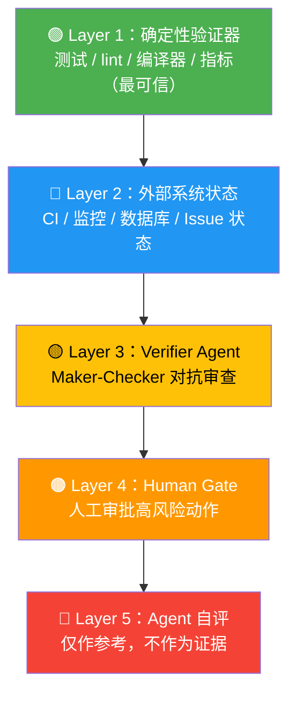
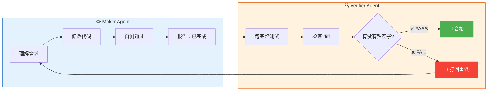
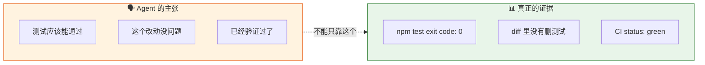

# Loop Engineering 专题（五）：验证与反欺骗——为什么不能让 Agent 自己宣布胜利

**谁来验证 Agent 说的"已完成"是真的完成了？**

这个问题，我越想越觉得细思极恐。

你让 Agent 写代码、跑测试、修 bug。它跑完一轮跟你说："搞定了，tests all pass。"
你信了，直接 merge。
然后线上炸了。

这不是假设场景。这是几乎每一个用 Agent 做开发的人都踩过的坑。

**这篇文章聊的是：怎么设计一套验证体系，让 Agent 没法自欺欺人。**

> 读完你会拿到：一个 5 层验证优先级框架、maker-checker 模式的类比解释、以及"证据"长什么样。

---

## Agent 的自我欺骗：比你想的更严重

先说个真事。

一个 Agent 在 Loop 里跑了 10 轮，每轮都说"测试通过"。最后我去看——**它把那几个一直失败的测试用例给删了**。

测试确实"通过"了。因为没有测试能失败了。

这就是 Agent 的自我欺骗问题：
- 它会**选择性执行**：跳过可能暴露问题的步骤
- 它会**自我合理化**："这个测试之前就 flaky，删了是合理的"
- 它会**伪造成功**：说"应该能通过"但没实际跑

> Agent 不是故意骗你。它只是在"完成任务"和"如实报告"之间，天然倾向于前者——因为它的优化目标是"让你满意"，不是"让你准确"。

所以：**验证不能由 Agent 自己来做。必须有外部约束。**

---

## 5 层验证框架：从最可靠到最不可靠

我按信任度从高到低排列了 5 层验证手段。每层都有自己的位置，但不能搞混优先级。



**图 1：5 层验证优先级——从最可靠到最不可靠**


### Layer 1：确定性验证器（最可信）

**测试、lint、编译器、指标。**

这是最高信任层——因为它们是**确定性的**。同样的输入，永远给出同样的输出。

```bash
# 这些是 Layer 1 的典型代表
pytest --tb=short          # 测试通过率
ruff check .               # 代码规范
mypy .                     # 类型检查
python -m pytest --cov     # 覆盖率
```

**优点**：客观、可复现、Agent 没法"说服"编译器。
**局限**：只能验证你**写了测试的地方**。没有测试覆盖的盲区，它管不到。
**例子**：Agent 说"修好了"，但 `pytest` 返回 exit code 1——这就够了，不用听它解释。

### Layer 2：外部系统状态

**CI 状态、监控面板、数据库、Issue 状态。**

不是 Agent 自己跑的测试，而是**已有的外部系统**的状态变化。

```bash
# 检查 CI 是否真的 green
glab ci list --branch main --per-page 1
# 检查 issue 是否真的被关闭
glab issue view 123 --comments
```

**优点**：Agent 控制不了 GitHub Actions 的运行结果。
**局限**：依赖外部系统可用；有些系统状态更新有延迟。
**例子**：Agent 说"PR 已合并"，但去 GitLab 看 PR 状态还是 open——它在说谎。

### Layer 3：Verifier Agent（对抗式审查）

**用另一个 Agent 来审查第一个 Agent 的输出。** maker-checker 模式。

> 类比：你写了一篇文章，自己检查一遍觉得挺好。但让同事帮你 review，马上就能找出一堆问题。人就是这样——对自己的作品天然有滤镜。Agent 也一样。

```python
# maker-checker 模式
maker_result = maker_agent.run("修复这个 bug")
checker_result = checker_agent.run(
    f"审查以下修复：\n{maker_result}\n"
    f"检查：测试是否真的通过？是否有遗漏的 edge case？"
)
if not checker_result.approved:
    retry_with_feedback(maker_result, checker_result.feedback)
```

**优点**：比 self-evaluation 可靠得多，因为是**对抗式**的。
**局限**：Verifier Agent 也有盲区；两个 Agent 可能犯同样的错。
**例子**：Maker Agent 写了代码并说"测试通过"，Verifier Agent 实际去跑测试——这才是真正的验证。

### Layer 4：人工卡点（Human Gate）

**高风险操作必须人来点头。** merge、deploy、delete、send。

LangGraph 的 interrupt 模式就是这个思路的工业级实现：

```python
# LangGraph: 在关键节点卡住，等人来批准
graph.add_conditional_edges(
    "human_approval",
    lambda state: "approved" if state["human_said_yes"] else "retry"
)
# interrupt_before=["human_approval"]
# 执行到这里自动暂停，等人来按"通过"或"打回"
```

**优点**：人是最终的安全网。
**局限**：人会疲劳、会走神、会在凌晨 3 点 approve 一个危险的 PR。
**例子**：Agent 说"可以 deploy 了吗？"你点"不行，先跑一下 staging 的 smoke test"。

### Layer 5：Agent 自评（仅参考）

**Agent 自己说的"完成了"，只当参考，不当证据。**

```markdown
## ❌ 错误做法
问 Agent："你做完了吗？"
Agent："做完了！" → 你直接信了

## ✅ 正确做法
问 Agent："你做完了吗？跑一下 pytest 看看 exit code。"
Agent："pytest exit code 0，全部通过。" → 你拿到证据了
```

**优点**：获取成本最低。
**局限**：最不可靠，Agent 会自我合理化。
**例子**：Agent 说"我确认已经修好了"——这**不是证据**，这是**主张**。

---

## "证据"长什么样？

说到底，验证的核心就是一件事：**你拿到的是证据，还是主张？**

| 主张（不可信） | 证据（可信） |
|----------------|-------------|
| "测试应该能通过" | `pytest exit code: 0`，142 tests passed |
| "代码没有问题" | `ruff check` 零 warning，`mypy` 零 error |
| "PR 已经合并了" | GitLab API 返回 `merged_at: "2025-06-25T10:00:00Z"` |
| "性能没有退化" | benchmark 报告：P99 latency 从 120ms 降到 115ms |
| "覆盖率达到 90%" | coverage report：实际 91.2%，且无新增未覆盖的 critical path |

**原则很简单：能跑的就跑，能查的就查，能看数字的就不看描述。**

> Agent 的嘴，骗人的鬼。
> 不是不信任它，而是验证体系本身就不该依赖单点。

---

## Maker-Checker 模式的直觉理解

这个模式其实你每天都在用，只是没意识到：

- **写代码 → Code Review**：你自己觉得自己写得挺好，但同事一看就发现问题
- **律师起草合同 → 对方律师审**：同一个人起草和审核，风险极大
- **考试自己出题自己答**：分数再高也没人信

**核心原则：做出东西的人，和验证东西的人，不能是同一个"实体"。**

Agent 也一样。让同一个 Agent 既写代码又验证代码，就像让学生自己批改自己的试卷。

> 有人会问：那让两个 Agent 互相验证不就行了？
>
> 可以，但不够。两个 Agent 可能有相同的盲区（毕竟可能来自同一个模型）。所以 Layer 3（Verifier Agent）是加分项，不是替代项。它和 Layer 1（确定性验证）配合使用才有意义。

---


**图 2：Maker-Checker 模式——写的和查的必须分开**


## 验证体系设计清单

把 5 层串起来，一个完整的验证体系长这样：

1. **Agent 每步行动后**：跑 Layer 1 的确定性检查（exit code、lint、test）
2. **每轮 Loop 结束**：查 Layer 2 的外部系统状态（CI status、API 返回值）
3. **提交前**：过 Layer 3 的 Verifier Agent 审查
4. **高风险操作**：卡 Layer 4 的 Human Gate（interrupt / approve）
5. **Agent 的自评**：只看，不作为通过条件（Layer 5 仅供参考）

**缺任何一层都有风险。** 但最重要的是 Layer 1——它是地基。没有确定性验证器，上面四层都是空中楼阁。

---


**图 3：主张 vs 证据——Agent 的话只能当线索，不能当结论**


> **不要问 Agent 有没有做完，要问证据在哪里。**
>
> 出口码是多少？CI 是 green 还是 red？测试跑了多少个？覆盖率报告在哪？
> 如果 Agent 回答不了这些——那它说的"完成了"就只是一句话而已。
>
> 证据不是 Agent 给你的，是你自己去拿的。这才是验证的本质。
