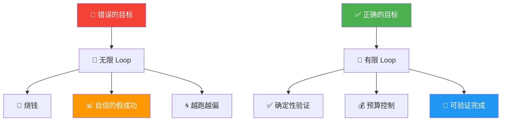
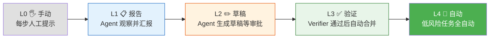

# Loop Engineering 专题（六）：避坑指南——Loop 不是万能药，这些坑我替你踩过了

前面五篇一直在说 Loop 的好话。

这篇我想反过来聊。

Loop 不是万能药。

我见过太多人（包括我自己）一上来就猛加循环，结果比不加循环的时候更糟。

不是 Loop 这个思想有问题，是我们把它想得太简单了。

这篇整理了 10 个最常见的坑，每个坑的症状、原因、怎么防，我都写了。

如果你刚开始做 Loop Engineering，这篇可以当避坑清单贴在工位上。

---

## 1. Loopmaxxing：以为循环次数越多越好

这可能是最普遍的坑。

以前搞 prompt engineering 的时候，有人迷信"多给 token 就能变好"，叫 tokenmaxxing。

现在搞 Loop Engineering，又有人迷信"多跑几轮总能搞定"，叫 Loopmaxxing。

症状很典型：

- 一个任务跑了 50 轮还没完
- 每轮都在改代码，但越改越乱
- 你问 Agent 在干嘛，它自己也说不清

根本原因就一句话：

> **如果目标是错的，更多循环只是更快地冲向错误方向。**

怎么防：

| 检查项 | 怎么做 |
|---|---|
| 目标是不是可验证的 | "优化代码"不是好目标，"`npm test` 退出码为 0"是 |
| 有没有进度感知 | 每轮对比 state，如果连续 3 轮没变化，停 |
| 有没有轮数上限 | 给一个硬上限，超过就停，不要"让 Agent 自己判断" |

---


**图 1：Loopmaxxing vs 正确的 Loop——目标决定一切**


## 2. 无限循环：停不下来的 Loop

这个坑的直觉画面是一只仓鼠跑轮子，一直在跑，永远停不下来。

没有终止条件的 Loop 会烧光你的 token 预算，然后给你一堆重复的中间产物。

症状：

- `while true` 跑了一晚上
- 第二天一看，50 轮的 token 账单比月工资还高
- 中间结果一塌糊涂

根本原因：你只写了"跑"，没写"什么时候停"。

一个合格的 Loop 必须有这四种停止条件：

```text
max_turns:    最多跑 N 轮
time_budget:  最多跑 M 分钟
token_budget: 最多花 X 美元
no_progress:  连续 N 轮 state 没变化就停
```

缺任何一种，都可能出问题。四种全有，才能安心睡觉。

---

## 3. 上下文溢出：Loop 跑着跑着就"痴呆"了

这个坑特别隐蔽。

前 10 轮表现很好，第 11 轮开始胡说八道。

原因很简单：上下文窗口装满了。

当对话历史、工具调用记录、中间结果把 context window 填满，模型就开始"失忆"。它会忘记之前的决策，重复之前的工作，甚至把已经修好的 bug 再修回去。

根本原因：你把所有记忆都放在对话历史里，没做外部化。

怎么防：

- **状态外部化**：每轮把关键信息写入 `STATE.md`，不依赖对话历史
- **每轮新开上下文**：Ralph Loop 的核心设计就是每轮新建 Agent
- **定期压缩**：每 N 轮做一次 compaction，把历史摘要化
- **限制每轮任务量**：一轮只做一个小任务，不要在一轮里塞十个操作

```text
坏的 Loop：
  Agent(第1轮) -> Agent(第2轮) -> ... -> Agent(第50轮)  // 上下文越来越脏

好的 Loop：
  Agent(新上下文) -> 读 STATE.md -> 执行 -> 写 STATE.md -> 停
  Agent(新上下文) -> 读 STATE.md -> 执行 -> 写 STATE.md -> 停
```

**记忆放在文件系统里，不要放在 Agent 脑子里。**

---

## 4. Agent 自我欺骗

这个坑在上一篇详细讲过了，这里只点一下。

症状：Agent 跑完一轮说"已完成"，但其实只是觉得自己完成了。测试没跑、CI 没过、diff 没看。

根本原因：没有外部验证，全靠 Agent 自评。

怎么防：确定性验证器（测试、lint、CI）+ Verifier Agent + Human Gate。

详细内容翻上一篇。

---

## 5. 多 Agent 协调失败：各干各的，互相打架

这个坑特别适合用一个比喻：三个厨师同时在一口锅里炒菜，每个人都在加盐，最后咸得没法吃。

Cognition 团队（Devin 的团队）有一句很有名的建议：

> **Don't Build Multi-Agents.**

不是说多 Agent 不行，而是说多 Agent 并行时，每个 Agent 会基于自己的观察做隐式决策。这些决策在各自看来都合理，合在一起就冲突了。

症状：

- Agent A 改了函数签名，Agent B 还在用旧签名调用
- 两个 Agent 同时修改同一个文件，最后 git merge 冲突
- 每个 Agent 报告"成功"，但整体任务是失败的

怎么防：

- 尽量单 Agent，能不并行就不并行
- 如果必须并行，严格划分每个 Agent 的修改范围
- 用文件锁或 task queue 避免冲突
- 最后一定要有一个整合验证步骤

---

## 6. 理解债务：代码写得比你看得快

这个坑很反直觉。

Loop 越高效，你越危险。

因为 Agent 的产出速度远超你的理解速度。跑十轮，改了 50 个文件，你的 PR review 根本看不完。最后你只能点 approve，因为"测试都过了"。

症状：

- 代码库越来越复杂，但你说不清为什么这样设计
- 你不再理解自己项目的某个模块
- 所有人的 review 方式变成"CI 过了就合并"

根本原因：Loop 的产出速率 > 人的理解速率。

怎么防：

- 控制每轮的任务粒度，小步快跑
- 要求 Agent 每轮输出可读的变更说明，不只是代码 diff
- 定期做"理解审计"：随机挑一个模块，你能说清楚它为什么这样吗？
- 接受一个事实：Loop 越强，你越需要主动管理理解债务

---

## 7. 认知投降：你不再有意见

这个坑比理解债务更深一层。

理解债务是你跟不上代码，认知投降是你不再尝试跟上。

症状：

- "反正 Loop 会搞定的"
- "测试过了就行"
- "我不太懂这段代码，但 CI 是绿的"
- 你上次主动 review 代码是什么时候？

根本原因：Agent 替你做了太多判断，你的判断力在萎缩。

怎么防：

- 保持"人必须理解核心决策"的底线
- 每次 Loop 产出，至少通读一遍 diff
- 定期关闭 Loop，自己手动完成一个任务，保持手感
- 记住：工具增强你，但不替代你

---

## 8. 成本爆炸：token 账单比工资高

这个坑最现实。

一个 Loop 跑 50 轮，每轮用 3 个 sub-agent，每个 sub-agent 花 10K token。

算一下：50 × 3 × 10K = 1.5M token。

按 GPT-4o 的价格，一趟就是几十美元。跑一周，一个月的 API 额度就没了。

怎么防：

- **从慢开始**：先跑 L1（只报告），确认有效再升级
- **监控成本**：每轮记录 token 用量和费用，设一个日预算上限
- **控制 sub-agent 数量**：不是越多越好，一个 Loop 里 2-3 个就差不多了
- **用便宜模型做初筛**：确定性验证用程序，不需要都上大模型

---

## 9. 错误的 Loop：不是所有任务都需要 Loop

这个坑最容易被忽略。

有些人拿到锤子，看什么都像钉子。Loop Engineering 确实很酷，但不是所有任务都适合。

适合 Loop 的任务特点：

- 有明确的、可验证的目标
- 可以拆成小步
- 每步的结果能被外部系统检查
- 需要反复迭代才能达标

不适合 Loop 的任务：

- "帮我写一首诗" → 一个 prompt 就够了
- "解释这段代码" → 单轮问答
- "做一下产品决策" → 需要人，不需要 Loop
- "写一个技术方案" → 可能需要研究，但不需要自动循环

一个简单的判断标准：

> **如果你不需要"根据结果决定是否继续"，那你不需要 Loop。**

单次调用能搞定的事，别用 Loop。

---

## 10. 没有验证的 Loop：最危险的 Loop

前九个坑是错误操作，这个坑是致命错误。

一个没有验证机制的 Loop，比没有 Loop 还危险。

因为它会非常自信地产出错误结果。

```text
没有 Loop：你写错代码，自己发现，自己修。

没有验证的 Loop：Agent 写错代码，Agent 觉得没问题，
循环继续，改了 50 个文件，每个都有问题，但全部绿灯。
```

记住这个优先级：

1. 确定性验证（测试、lint、编译）
2. 外部系统验证（CI 状态、监控）
3. Verifier Agent（补充检查）
4. Human Gate（高风险审批）

**绝对不能只有 Agent 自评。**

---

## Loop 成熟度阶梯

最后这张图是我自己的分级，帮你判断你现在在哪个阶段，下一步该往哪走。

```text
L0  手动    → 人写 prompt，人检查结果，人决定下一步
L1  报告    → Loop 只生成报告，不改代码，人做决策
L2  草稿    → Loop 可以提 draft PR，人 review 后合并
L3  验证    → Loop 改代码，通过测试后才提交，人做终审
L4  自动合并 → Loop 改代码 + 测试 + 自动合并，人只做例外审批
```

| 级别 | Agent 能做什么 | 人需要做什么 | 风险 |
|---|---|---|---|
| L0 | 等待指令 | 全部手动 | 最低 |
| L1 | 生成报告 | 看报告，做决策 | 低 |
| L2 | 生成代码草稿 | Review PR，决定合并 | 中 |
| L3 | 改代码 + 通过测试 | 终审 | 中高 |
| L4 | 改代码 + 测试 + 自动合并 | 例外审批 | 高 |

我的建议：**所有人的 Loop 都应该从 L1 开始。**

不要跳级。

先让 Loop 证明它能稳定产出有用的报告，再给它更多权限。

每升一级，都是在和风险做交易。你必须确定上一级已经稳了，才该往下走。

---


**图 2：Loop 成熟度阶梯——从 L0 到 L4，逐级升级**


## 一句话总结

Loop Engineering 的坑，本质上都是同一件事：

> **你给了 Agent 执行力，但没给它约束力。**

执行力让 Agent 能做事。

约束力让 Agent 做对事。

Loop 不是万能药。但如果你把这篇文章里的 10 个坑都避开了，Loop 就会变成一个非常可靠的工程系统。

下一篇，我们从零动手搭一个 Loop。

理论说再多，不如自己跑一次。

---

## 系列文章

这是"Loop Engineering 专题"的第六篇。上一篇是《验证机制》，下一篇是《动手实战》。

系列核心观点：

> Loop Engineering 不是让 Agent 多跑几轮，而是设计一个系统，让 Agent 跑在有护栏、有路标、有终点线的路上。
