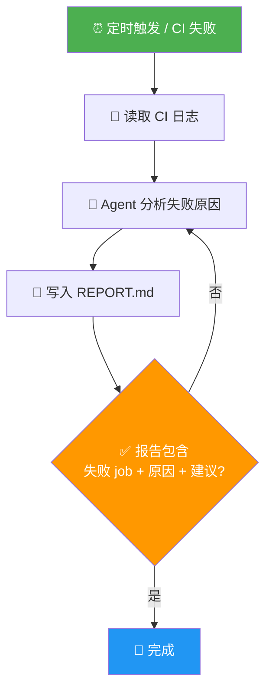

# Loop Engineering 专题（七）：动手实战——从零搭建你的第一个 Loop，7 步走

看完前面六篇，如果你还没动手过，那理解永远停在纸面上。

这篇我们从零搭一个最小 Loop。

不需要复杂框架，不需要多 Agent 编排，不需要 LangGraph。就用你手边的工具，7 步走完。

我会用一个真实场景做主线：CI 失败自动归因。这个场景简单、可验证、不需要改生产代码，非常适合入门。

---
## 7 步概览


**图 1：7 步搭建你的第一个 Loop**

## Step 1：选任务——从简单的开始

Loop 的第一个任务，必须满足三个条件：

1. **输入明确**：CI 失败了，有日志
2. **输出可验证**：归因报告是否覆盖了失败 job，是否给出了原因
3. **风险低**：只生成报告，不改代码

适合入门的 Loop 任务：

| 任务 | 输入 | 输出 | 为什么适合 |
|---|---|---|---|
| CI 失败归因 | CI 日志 | 失败原因 + 建议 | 纯分析，不改代码 |
| Issue 分类 | Issue 内容 | 标签 + 优先级 | 有标准答案 |
| 依赖更新检查 | package.json | 过期依赖列表 | 确定性输出 |
| 日志异常扫描 | 日志文件 | 异常摘要 | 纯读取，无副作用 |

**不要选的**："重构认证模块""优化数据库查询"——这些目标太模糊，不适合第一个 Loop。

---

## Step 2：定义目标——必须可验证

这一步很多人会跳过，然后掉进坑里。

坏目标 vs 好目标：

```text
坏目标：
  - 分析 CI 失败
  - 提高代码质量
  - 自动修复问题

好目标：
  - 读取最近 5 个失败 CI run 的日志
  - 对每个失败 job，输出：job 名、失败命令、关键错误信息、疑似原因
  - 报告写入 REPORT.md
  - 不修改任何代码文件
  - 完成标志：REPORT.md 包含至少 3 个失败 job 的分析
```

好目标的特征：**系统能检查对错，不需要人猜。**

怎么验证目标达标了？写一个简单的检查脚本：

```bash
# verify.sh：验证报告是否合格
REPORT="REPORT.md"

# 检查文件是否存在
if [ ! -f "$REPORT" ]; then
  echo "FAIL: REPORT.md 不存在"
  exit 1
fi

# 检查是否包含失败 job 分析
JOB_COUNT=$(grep -c "### Job:" "$REPORT")
if [ "$JOB_COUNT" -lt 1 ]; then
  echo "FAIL: 至少需要分析 1 个失败 job"
  exit 1
fi

# 检查是否包含关键字段
for field in "失败命令" "关键错误" "疑似原因"; do
  if ! grep -q "$field" "$REPORT"; then
    echo "FAIL: 缺少字段: $field"
    exit 1
  fi
done

echo "PASS: 报告合格"
```

这就是你的验证器。简单，但有效。

---

## Step 3：建立外部状态

Loop 需要"记忆"，但这个记忆不能只放在 Agent 的对话历史里。

创建一个 `STATE.md`：

```markdown
# CI Triage Loop 状态

## 运行记录
| 时间 | Run ID | 状态 | 备注 |
|---|---|---|---|
| （待填充） | | | |

## 当前进度
- 下一个要分析的 Run：（等待首次运行）
- 已分析总数：0
- 今日预算消耗：$0.00

## 历史发现
（待填充）
```

每次 Loop 运行，读这个文件，更新这个文件。

下一次运行再读这个文件，就知道上次做到哪了。

这就是把记忆从 Agent 脑子搬到文件系统里。

---

## Step 4：写 AGENTS.md

`AGENTS.md` 是给 Agent 的"岗位说明书"。告诉它：你是谁、你能做什么、你不能做什么、你要怎么做。

```markdown
# CI Triage Agent

## 角色
你是 CI 失败分析助手。你的工作是读取 CI 失败日志，分析失败原因，输出结构化报告。

## 能做什么
- 读取 CI 日志文件
- 读取最近的 git commit
- 读取相关测试文件
- 写入 REPORT.md
- 更新 STATE.md

## 不能做什么
- 不能修改任何源代码文件
- 不能运行 npm test 等命令（只读取已有日志）
- 不能删除或修改 CI 配置
- 不能访问生产环境

## 输出格式
对每个失败 job，输出：
### Job: [job 名称]
- **失败命令**：具体是哪一步失败的
- **关键错误**：报错信息中最有价值的 1-3 行
- **疑似原因**：你的判断（代码问题/环境问题/依赖问题/配置问题）
- **建议 owner**：根据文件路径推测谁最可能修

## 工作流程
1. 读取 STATE.md，找到下一个要分析的 Run
2. 读取对应的 CI 日志
3. 分析失败原因
4. 写入 REPORT.md
5. 更新 STATE.md
6. 停止（不要开始分析下一个 Run）
```

关键点：**明确边界**。告诉 Agent 什么不能做，比告诉它做什么更重要。

---

## Step 5：搭建循环

最简版本，用 bash 就够了。

```bash
#!/bin/bash
# loop.sh - CI Triage 最小 Loop

MAX_TURNS=5
TIME_BUDGET=600  # 10 分钟
TURN=0
START_TIME=$(date +%s)

echo "=== CI Triage Loop 启动 ==="

while [ $TURN -lt $MAX_TURNS ]; do
  # 检查时间预算
  ELAPSED=$(( $(date +%s) - START_TIME ))
  if [ $ELAPSED -ge $TIME_BUDGET ]; then
    echo "时间预算耗时 ${ELAPSED}s，停止"
    break
  fi

  TURN=$((TURN + 1))
  echo "--- 第 ${TURN} 轮 ---"

  # 检查是否已完成
  if grep -q "ALL DONE" STATE.md 2>/dev/null; then
    echo "所有任务已完成"
    break
  fi

  # 调用 Agent
  claude -p "$(cat AGENTS.md)

当前是第 ${TURN}/${MAX_TURNS} 轮。
请读取 STATE.md 和相关 CI 日志，分析一个失败的 CI run，更新 REPORT.md 和 STATE.md。
如果所有 run 都已分析完毕，在 STATE.md 中写入 'ALL DONE'。"

  # 验证本轮结果
  if [ -f "REPORT.md" ]; then
    bash verify.sh
  fi

  echo "--- 第 ${TURN} 轮结束 ---"
done

echo "=== Loop 结束：共 ${TURN} 轮，耗时 $(( $(date +%s) - START_TIME ))s ==="
```

逐行解释一下关键设计：

- `MAX_TURNS=5`：硬上限，防止无限循环
- `TIME_BUDGET=600`：时间熔断
- 每轮开一个新 `claude` 进程：上下文干净，不会溢出
- Agent 每轮读 `STATE.md`：知道上次做到哪了
- `verify.sh`：每轮跑一次验证，不通过就看到错误

---

## Step 6：接入验证

Step 2 里写了 `verify.sh`，现在把它接到 Loop 里。

在上面的 `loop.sh` 中，每轮结束都会跑 `verify.sh`。

但还可以再加一层：**在 Loop 结束后做总验证。**

```bash
# verify_all.sh - 总验证
echo "=== 最终验证 ==="

# 1. 报告存在且合格
bash verify.sh || exit 1

# 2. STATE.md 被更新
if ! grep -q "已分析" STATE.md; then
  echo "FAIL: STATE.md 没有更新"
  exit 1
fi

# 3. 没有修改源代码（关键安全检查）
if git diff --name-only | grep -v -E '(REPORT.md|STATE.md)'; then
  echo "FAIL: Agent 修改了非报告文件！"
  exit 1
fi

echo "=== 所有验证通过 ==="
```

第 3 条特别重要。你在 L1 阶段，Agent 只能写报告。如果它偷偷改了代码，你必须知道。

加验证前后对比：

```text
加之前：
  Agent 跑 5 轮 → 生成一堆文件 → 你不确定结果对不对

加之后：
  Agent 跑 5 轮 → 每轮验证 → 最终验证 → 你确定结果合格
```

---

## Step 7：加安全措施

最后一步，也是最容易忘记的一步。

在 `loop.sh` 的基础上，加三个安全机制：

```bash
# 在 loop.sh 顶部加入
MAX_TURNS=5
TIME_BUDGET=600
TOKEN_BUDGET=5.00  # 最多花 5 美元

# 在每轮结束后加入
check_budget() {
  # 简化版：用时间近似代替 token 消耗
  # 实际项目中应该记录每次 API 调用的 token 用量
  ELAPSED=$(( $(date +%s) - START_TIME ))
  COST_APPROX=$(echo "scale=2; $ELAPSED * 0.001" | bc)

  if (( $(echo "$COST_APPROX > $TOKEN_BUDGET" | bc -l) )); then
    echo "预算超限 $${COST_APPROX}，停止"
    exit 0
  fi
}

# 无进展检测：连续 2 轮 state 没变化就停
PREV_STATE=""
STALL_COUNT=0

check_progress() {
  CURRENT_STATE=$(cat STATE.md | md5sum | cut -d' ' -f1)
  if [ "$CURRENT_STATE" = "$PREV_STATE" ]; then
    STALL_COUNT=$((STALL_COUNT + 1))
    if [ $STALL_COUNT -ge 2 ]; then
      echo "连续 ${STALL_COUNT} 轮无进展，停止"
      exit 0
    fi
  else
    STALL_COUNT=0
    PREV_STATE="$CURRENT_STATE"
  fi
}
```

安全措施总结：

```text
max_turns:     防止无限轮次
time_budget:   防止跑太久
token_budget:  防止烧太多钱
no_progress:   防止无效循环
file_guard:    防止修改不该改的文件
```

五个全有，才敢放手让 Loop 跑。

---

## 完整示例：CI Triage Loop

把上面 7 步串起来，完整项目结构长这样：

```text
ci-triage-loop/
├── AGENTS.md          # Agent 岗位说明书
├── STATE.md           # 外部状态
├── REPORT.md          # 输出报告（自动生成）
├── loop.sh            # 主循环脚本
├── verify.sh          # 单轮验证
└── verify_all.sh      # 总验证
```

运行方式：

```bash
# 首次运行
cd ci-triage-loop
bash loop.sh

# 查看结果
cat REPORT.md
cat STATE.md

# 检查是否安全
git diff --name-only  # 应该只有 REPORT.md 和 STATE.md
```

整个过程不超过 30 衒代码。

但它已经是一个完整的 Loop Engineering 实例：

- 有触发（运行脚本）
- 有目标（分析 CI 失败）
- 有状态（STATE.md）
- 有验证（verify.sh + verify_all.sh）
- 有安全措施（max turns + time + no-progress + file guard）
- 有边界（AGENTS.md 明确不能做什么）

---

## Loop 设计清单

每次设计新 Loop，过一遍这张表：

| 检查项 | 你做了吗？ | 怎么做 |
|---|---|---|
| 任务选对了吗 | ☐ | 简单、可验证、低风险 |
| 目标可验证吗 | ☐ | 系统能检查，不需要人猜 |
| 外部状态建了吗 | ☐ | STATE.md / TODO.md |
| Agent 边界明确吗 | ☐ | AGENTS.md 写清楚能做/不能做 |
| 终止条件设了吗 | ☐ | max_turns + time + token + no-progress |
| 验证器接入了吗 | ☐ | 每轮验证 + 最终验证 |
| 安全措施到位了吗 | ☐ | 文件守卫 + 人工门禁 |
| 成本可追踪吗 | ☐ | 每轮记录 token 用量 |

8 个都打勾了，你的 Loop 才算及格。

---

## 最后的建议：从 L1 开始，跑一周

很多人看完教程，上来就想搭 L3、L4 的全自动 Loop。

我的建议是：**别急。**

```text
第一天：  搭好 L1，跑一次，看看报告质量
第三天：  调整 AGENTS.md，让报告更准确
第七天：  如果 L1 稳定了，考虑升级到 L2（允许提 draft PR）
第三十天：如果 L2 也稳了，再考虑 L3
```

每个阶段至少跑一周。

不要跳级。

因为每一级的信任都是挣来的，不是假设来的。

Loop Engineering 最怕的不是技术难度，而是你太快给了 Agent 它还配不上的信任。

---




**图 2：CI Triage Loop 完整流程——你的第一个可运行 Loop**


## 系列文章

这是"Loop Engineering 专题"的第七篇。上一篇是《避坑指南》。

系列核心观点：

> Loop Engineering 不是让 Agent 多跑几轮，而是设计一个系统，让 Agent 跑在有护栏、有路标、有终点线的路上。

动手跑一次，比读十篇文章有用。
