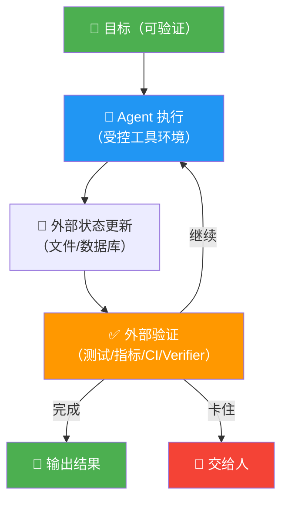

# Loop Engineering 专题（八）：总结与展望——回到最初的问题，我们到底学到了什么

写完这个系列，我回头翻了前面几篇，发现一个问题。

我自己都写这么多了，能不能用一句话说清楚 Loop Engineering 到底是什么？

试了一下，还真能：

> **Loop Engineering 是设计一套围绕 Agent 的执行闭环——让它不靠自我感觉宣布完成，而是靠外部证据证明完成。**

就这样。没有新词，没有缩写，没有框架名。

---

## 回到最初的问题

这个系列的起点很简单：我发现自己总是在 babysitting AI。

写完一段代码，得自己跑测试。跑完测试，得自己看日志。看完日志，得自己告诉它怎么改。改完之后，又得重新来一遍。

一轮一轮地手动提示，像在给一个很聪明但没有手的实习生当手。

这就是"为什么要做 Loop Engineering"的起点。

不是因为某个概念很酷，而是因为**不自动化这些循环，我就成了 Agent 的人肉调度器**。

---

## 这一路我们学到了什么

简单串一下整个系列的脉络：

1. **Prompt Engineering** 解决的是"怎么问，模型才答得好"
2. **Context Engineering** 解决的是"这一轮让模型看到什么"
3. **Harness** 解决的是"模型这一轮能做什么、能碰什么"
4. **Loop Engineering** 解决的是"做完之后，怎么自动进入下一轮，以及凭什么说完成"

四层递进，每一层都在补上一层的缺口。

而 Loop Engineering 是最外面那层——它决定了前面三层能不能真正形成一个**持续交付**的系统，而不是一次性的问答。

---

## 一张图记住所有核心

如果只记一张图，我建议记这个：

**Loop Engineering 的全部骨架——一张图记住所有核心**

这就是 Loop Engineering 的全部骨架。

四个东西缺一个，Loop 就会出问题：

- **没有外部状态**：Agent 下一轮失忆
- **没有外部验证**：Agent 自己骗自己
- **没有停止条件**：Loop 烧钱烧 token
- **没有人工兜底**：高风险动作没人审批

---

## 三个根本问题，各一句话回答

**什么是 Loop Engineering？**

设计一个围绕 Agent 的自动执行闭环，用外部状态、外部验证和停止条件取代人工 babysitting。

**为什么重要？**

因为代码生成已经变便宜了，真正贵的是"怎么知道生成的是对的"——Loop Engineering 就是解决这个问题的。

**怎么开始？**

先做一个 report-only 的小 Loop（比如每天自动分析 CI 失败原因），跑稳了再升级到辅助修复，最后才考虑无人值守。

---

## 一个原则我反复想了很久：不要让 Agent 自己宣布胜利

这个系列里我花最多篇幅讲的就是验证。

因为这是我踩坑最深的地方。

Agent 不是恶意骗你，它是"语言模型的自我合理化"——它会倾向于把自己的工作解释成已经完成。

所以成熟的做法是：**不要问 Agent 有没有做完，要问证据在哪里**。

- `npm test` 的退出码是什么？
- CI 状态是什么？
- 覆盖率报告是什么？
- 指标比 baseline 好还是差？

让环境说话，不要让 Agent 说话。

---

## 往前看：Loop 会走向哪里

我觉得有几个方向是比较确定的：

- Loop 会越来越自主，但**验证只会越来越重要**，不会越来越弱
- "Agent 能跑"和"Agent 能交付"之间的差距，就是 Loop 设计的差距
- 人的角色会从"写 prompt 的人"变成"设计 Loop 的人"——prompt architect 变成 loop architect

就像现在没有人会觉得写 SQL 就够了，以后也不会觉得写 prompt 就够了。

真正的能力差距，在于你能不能设计一条有护栏、有路标、有终点线的路。

---

## 最后一句

Loop Engineering 不是让 AI 替代你工作，而是让你把精力花在更值得的地方——设计规则、定义标准、审核结果。

这才是工程师真正该做的事。

---

## 本系列全部文章

1. 从 Prompt Engineering 到 Loop Engineering，Agent 真正变强的地方可能不在模型本身
2. Loop Engineering 续集：别只让 Agent 循环，关键是让它不能骗自己已经完成
3. Loop Engineering 专题（一）：从 Prompt 到 Loop，Agent 为什么需要"自动驾驶"
4. Loop Engineering 专题（二）：外部状态，Agent 的长期记忆不能只靠上下文
5. Loop Engineering 专题（三）：Harness 是 Agent 的手脚，Loop 是它的方向盘
6. Loop Engineering 专题（四）：验证机制——怎么知道 Agent 真的做完了
7. Loop Engineering 专题（五）：停止条件——Loop 最容易忽略的设计
8. Loop Engineering 专题（六）：人机协作——Human-in-the-loop 不是口号
9. Loop Engineering 专题（七）：落地实操——从零搭一个最小可行 Loop
10. Loop Engineering 专题（八）：总结与展望——回到最初的问题，我们到底学到了什么（本文）

---

## 参考资料

- Addy Osmani：Loop Engineering / Agent Harness Engineering
- Geoffrey Huntley：Ralph Wiggum as a software engineer
- Karpathy：`karpathy/autoresearch`
- GitHub：`cobusgreyling/loop-engineering`
- LangGraph / OpenAI Agents SDK / Pydantic AI / smolagents / AutoGPT
